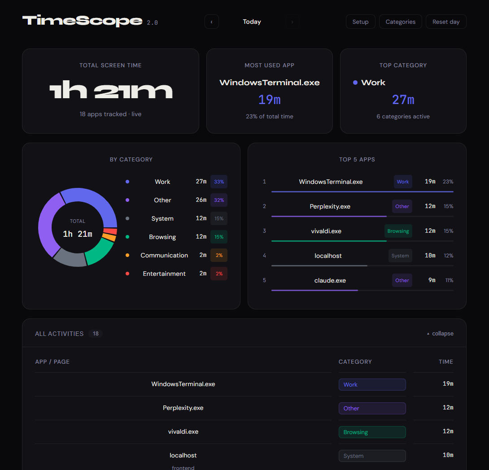

# ⏱ TimeScope — Windows Productivity Tracker

A full-stack productivity tracker that logs your active Windows apps every 30 seconds and visualizes your day with an AI-generated summary.



## Tech Stack

| Layer | Technology |
|-------|-----------|
| Backend | Java Spring Boot 3.2 + SQLite (JPA + Hibernate) |
| Frontend | React TypeScript + Vite + Recharts |
| Logger | Python (pywin32 + psutil) |
| AI | Ollama + Llama 3 (local inference) |

## Architecture
Python Logger (every 30s)
→ POST /api/logs (Spring Boot :8080)
→ SQLite (timescope.db)
→ GET /api/usage (React dashboard :5173)
→ GET /api/summary (Ollama Llama3 :11434)

## Getting Started

### Prerequisites
- Java 17+
- Python 3.8+
- Node.js 18+
- [Ollama](https://ollama.ai) with Llama 3 pulled (`ollama pull llama3`)

### Run

**1. Backend**
```bash
cd backend
mvn spring-boot:run
```

**2. Frontend**
```bash
cd frontend
npm install
npm run dev
```

**3. Logger**
```bash
cd logger
pip install requests psutil pywin32
python main.py
```

**4. Ollama**
```bash
ollama serve
```

Open http://localhost:5173

## API Endpoints

| Method | Endpoint | Description |
|--------|----------|-------------|
| POST | `/api/logs` | Receives `{appName, windowTitle, timestamp}` from logger |
| GET | `/api/usage?date=YYYY-MM-DD` | Returns time-per-app in minutes |
| GET | `/api/summary?date=YYYY-MM-DD` | Returns Llama 3 AI summary of the day |

## Built For
Java Full Stack Internship application — built end-to-end in ~4 hours.
